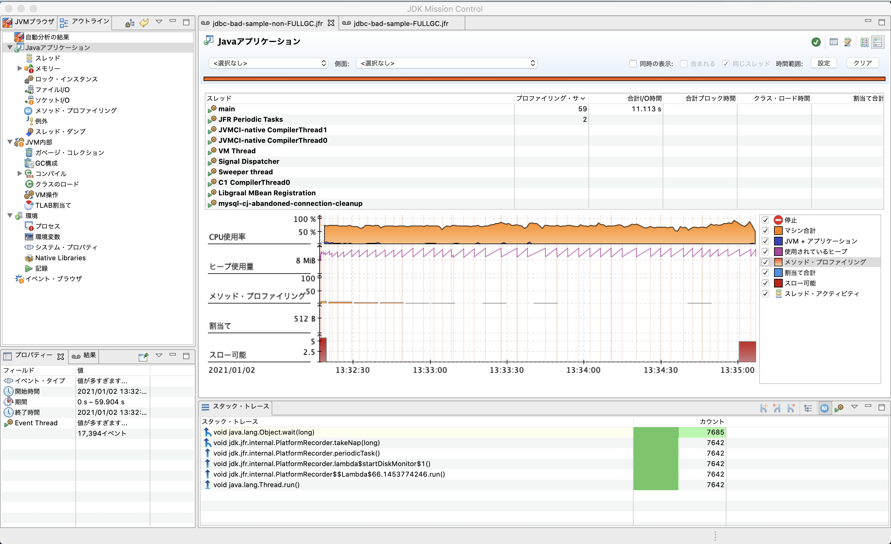
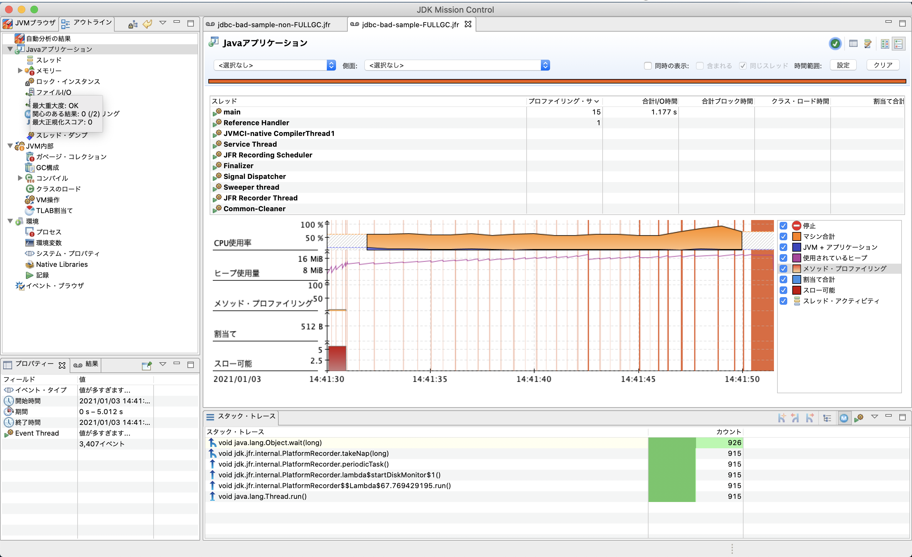

# はじめに
- JJUG CCC 2021 Spring で発表した [JFR などのツールを用いて FullGC や OOME の原因を特定する流れ](https://fortee.jp/jjug-ccc-2021-spring/proposal/83439492-e768-427e-b5ca-a1f6bd20aa4b) のサンプルコードです。
    - 発表資料: https://speakerdeck.com/takaichi00/jjug-ccc-2021-spring-resolving-oome-with-jfr
    - 発表動画: https://www.youtube.com/watch?v=QlyixJVFhzA&list=PLy44EKO1L0eKJ_gTREaeZhqGp2Giey1Sl&index=22

# JFR (JDK Flight Recorder) の解析
## 事前準備
* アプリケーションをビルド

```
mvn clean package
```

* Docker で MySQL DB を立ち上げる

```
cd local-env
docker-compose up -d
```

- テーブルのスキーマを flyway を用いて作成

```
mvn flyway:migrate

# スキーマ管理を再作成するときは以下のコマンドを実行します
mvn flyway:clean flyway:migrate
```

* csv データを MySQL に insert

```
# https://mita2db.hateblo.jp/entry/2020/01/13/163218
mysql -u root -h 127.0.0.1 -P 13306 -proot -D test_database --local-infile=1

# ideaProjects ディレクトリに clone した場合
mysql> SET GLOBAL local_infile=on;
mysql> load data local infile "~/ideaProjects/jfr-sample/jdbc-bad-sample/src/main/resources/insert_tableA.csv" into table TABLE_A fields terminated by ',' optionally enclosed by '"';
mysql> load data local infile "~/ideaProjects/jfr-sample/jdbc-bad-sample/src/main/resources/insert_tableB.csv" into table TABLE_B fields terminated by ',' optionally enclosed by '"';
```


## JFR を有効にしてアプリケーションを起動

* 以下のコマンドを実行してアプリーケーションを起動
```
java \
-XX:StartFlightRecording=\ # JFR を有効にする
dumponexit=true,\  # JVM プロセスがシャットダウンした時にファイルにダンプする
filename=./output/jdbc-bad-sample-FULLGC.jfr\
-Xms20M -Xmx20M -jar ./target/jdbc-bad-sample.jar
```

* しばらくすると、`Exception in thread "main" java.lang.OutOfMemoryError: Java heap space` が表示される


## JMC で解析
* JMC (JDK Mission Control) のダウンロード
  * Oracle: (https://www.oracle.com/java/technologies/javase/products-jmc8-downloads.html)
  * AdoptOpenJDK: (https://adoptopenjdk.net/jmc.html)
  * Zulu: (https://jp.azul.com/products/zulu-mission-control/)
* JMC の起動
  * 「ファイル(F)」→「ファイルを開く」から生成した jdbc-bad-sample-non-FULLGC.jfr, jdbc-bad-sample-FULLGC.jfr を選択すると分析結果が表示されていることを確認





## JFR でより詳細な情報を取得する
※ 詳細な情報を取得する際は、JFR のオーバーヘッドも大きくなり性能劣化が発生するため、パフォーマンスに影響がでてはいけない環境での実行は控える

- ヒープに関する詳細情報を取得したい場合
```
java \
-XX:StartFlightRecording=\ # JFR を有効にする
dumponexit=true,\  # JVM プロセスがシャットダウンした時にファイルにダンプする
filename=./output/jdbc-bad-sample-FULLGC.jfr,\
path-to-gc-roots=true \ # ヒープ統計を有効にする。実行の開始時と終了時に Old ガベージ・コレクションがトリガーされる。
-Xms20M -Xmx20M -jar ./target/jdbc-bad-sample.jar
```

- JFR でより詳細な情報を取得したい場合
    - 例えば先程指定した `path-to-gc-roots` オプションは、profile.jfc を指定すると、リークの可能性があるオブジェクトに対して、割り当てられている場所からのスタックトレースを確認することができる
```
java \
-XX:StartFlightRecording=\
dumponexit=true,\
filename=./output/jdbc-bad-sample-FULLGC-profile.jfr,\
disk=true,\
path-to-gc-roots=true,\
settings=profile \ # より詳細な情報を取得する Profile を指定
-Xms20M -Xmx20M -jar ./target/jdbc-bad-sample.jar
```

# Heap Dump の取得

## OOME 発生時に Heap Dump を取得する

* 以下のコマンドを実行すると、OOME 発生時に .hprof ファイルが作成される

```
java \
-XX:+HeapDumpOnOutOfMemoryError \
-XX:HeapDumpPath=./output \
-Xms20M -Xmx20M -jar ./target/jdbc-bad-sample.jar
```

## リアルタイムで Heap Dump を取得

```
# ヒープダンプの生成前に FullGC を実施
jmap -dump:live,file=<FILE_PATH> <JAVA_PID>

# 以下のコマンドでも ヒープダンプを取得可能
jcmd <JAVA_PID> GC.heap_dump <FILE_PATH>
```

* 実行例

```
jcmd `jps -v | grep jdbc-bad-sample | awk '{print $1}'` GC.heap_dump ./output/
```


## Memory Analyzer での解析

* 作成された .hprof ファイルは Memory Analyzer で解析可能
  * http://www.eclipse.org/mat/ からダウンロード可能
