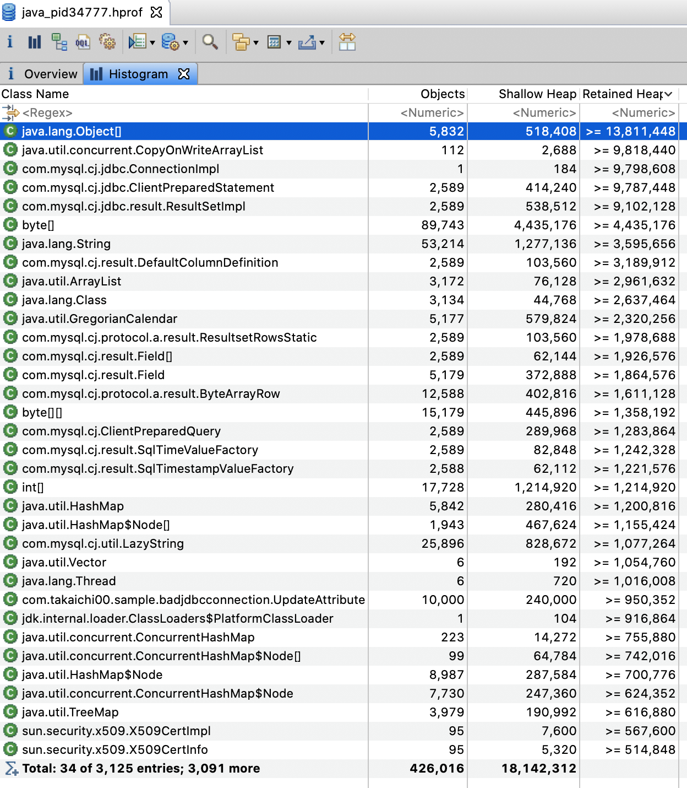
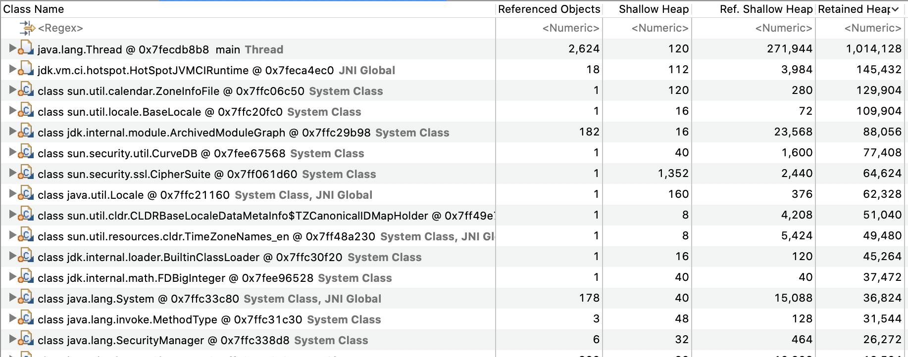

# jfr-sample

## 参考文献
- [サンプルプログラムはこちらのリポジトリを参考](https://github.com/Takaichi00/jdbc-bad-sample)
- [最初の1リクエスト目で何をしているのか？](https://b.chiroito.dev/entry/2020/09/20/212719)
- [Java Flight Recorderでトラブルシューティング](https://qiita.com/sahn/items/952f8c1fdc463fa372b4)
- [JDBC & JFR Sample](https://github.com/chiroito/Jfr4Jdbc)
- [Quarkus で JFR Event Streaming](https://b.chiroito.dev/entry/2020/05/28/185832)
- [JITとコードの暖気の実体](https://b.chiroito.dev/entry/2020/09/18/221458)
- [Rediness Probeでアプリケーションが十分にJITされたことを検知する](https://b.chiroito.dev/entry/2020/09/19/225533)
- [Java Mission Control の紹介 (JMC)](https://docs.oracle.com/javase/jp/7/technotes/guides/jmc/intro.html)
- [パフォーマンスのトラブルシュート入門](https://speakerdeck.com/chiroito/getting-started-performance-troubleshoot)
- [Java 11のFlight Recorderを試す](https://matsumana.info/blog/2018/10/16/jdk11-flight-recorder/)
- [JFR に関する情報がまとまった gitbook ページ](https://koduki.github.io/docs/book-introduction-of-jfr/site/)
    - [1.2 Javaにおけるパフォーマンス分析と障害診断](https://koduki.github.io/docs/book-introduction-of-jfr/site/01/02-other_tools.html)
        - こちらは JFR に限らず Java におけるいろいろなツール (jps, jstack, etc...)が紹介されている

## 実行メモ
- 実行時に `-XX:StartFlightRecording` をつける
    - [Java 11のFlight Recorderを試す](https://matsumana.info/blog/2018/10/16/jdk11-flight-recorder/)
```
mvn clean package -DskipTests=true
java -jar target/quarkus-sample-0.0.1-SNAPSHOT-runner.jar -XX:StartFlightRecording
```
- `jmc` コマンドを実行しようとしたが、`$JAVA_HOME` に jmc コマンドがない
  - どうやらデフォルトのコマンドではなくなったよう。https://stackoverflow.com/questions/53882496/openjdk-jdk11-not-having-jmc-java-mission-controller-flightrecorder
    - ~~[1.4 JFRの動作環境とJMCのインストール](https://koduki.github.io/docs/book-introduction-of-jfr/site/01/04-install_jmc.html)を参考に、docker で起動してみる~~
      - この方法もうまくいかなかった。以下実行履歴。
```
git clone https://github.com/openjdk/jmc.git
cd jmc
docker-compose -f docker/docker-compose.yml run jmc

...
[WARNING] Error injecting: org.eclipse.tycho.core.maven.TychoMavenLifecycleParticipant
java.lang.TypeNotPresentException: Type org.eclipse.tycho.core.maven.TychoMavenLifecycleParticipant not present
	at org.eclipse.sisu.space.URLClassSpace.loadClass(URLClassSpace.java:147)
	at org.eclipse.sisu.space.NamedClass.load(NamedClass.java:46)
	at org.eclipse.sisu.space.AbstractDeferredClass.get(AbstractDeferredClass.java:48)
	at com.google.inject.internal.ProviderInternalFactory.provision(ProviderInternalFactory.java:81)
	at com.google.inject.internal.InternalFactoryToInitializableAdapter.provision(InternalFactoryToInitializableAdapter.java:53)
	at com.google.inject.internal.ProviderInternalFactory$1.call(ProviderInternalFactory.java:65)
	at com.google.inject.internal.ProvisionListenerStackCallback$Provision.provision(ProvisionListenerStackCallback.java:115)
	at org.eclipse.sisu.bean.BeanScheduler$Activator.onProvision(BeanScheduler.java:176)
	at com.google.inject.internal.ProvisionListenerStackCallback$Provision.provision(ProvisionListenerStackCallback.java:126)
	at com.google.inject.internal.ProvisionListenerStackCallback.provision(ProvisionListenerStackCallback.java:68)
	at com.google.inject.internal.ProviderInternalFactory.circularGet(ProviderInternalFactory.java:63)
	at com.google.inject.internal.InternalFactoryToInitializableAdapter.get(InternalFactoryToInitializableAdapter.java:45)
	at com.google.inject.internal.ProviderToInternalFactoryAdapter$1.call(ProviderToInternalFactoryAdapter.java:46)
	at com.google.inject.internal.InjectorImpl.callInContext(InjectorImpl.java:1103)
	at com.google.inject.internal.ProviderToInternalFactoryAdapter.get(ProviderToInternalFactoryAdapter.java:40)
	at com.google.inject.internal.SingletonScope$1.get(SingletonScope.java:145)
	at com.google.inject.internal.InternalFactoryToProviderAdapter.get(InternalFactoryToProviderAdapter.java:41)
	at com.google.inject.internal.InjectorImpl$2$1.call(InjectorImpl.java:1016)
	at com.google.inject.internal.InjectorImpl.callInContext(InjectorImpl.java:1092)
	at com.google.inject.internal.InjectorImpl$2.get(InjectorImpl.java:1012)
	at org.eclipse.sisu.inject.LazyBeanEntry.getValue(LazyBeanEntry.java:81)
	at org.eclipse.sisu.plexus.LazyPlexusBean.getValue(LazyPlexusBean.java:51)
	at org.eclipse.sisu.wire.EntryListAdapter$ValueIterator.next(EntryListAdapter.java:111)
	at java.util.AbstractCollection.addAll(AbstractCollection.java:343)
	at org.apache.maven.DefaultMaven.getLifecycleParticipants(DefaultMaven.java:400)
	at org.apache.maven.DefaultMaven.doExecute(DefaultMaven.java:262)
	at org.apache.maven.DefaultMaven.doExecute(DefaultMaven.java:193)
	at org.apache.maven.DefaultMaven.execute(DefaultMaven.java:106)
	at org.apache.maven.cli.MavenCli.execute(MavenCli.java:863)
	at org.apache.maven.cli.MavenCli.doMain(MavenCli.java:288)
	at org.apache.maven.cli.MavenCli.main(MavenCli.java:199)
	at sun.reflect.NativeMethodAccessorImpl.invoke0(Native Method)
	at sun.reflect.NativeMethodAccessorImpl.invoke(NativeMethodAccessorImpl.java:62)
	at sun.reflect.DelegatingMethodAccessorImpl.invoke(DelegatingMethodAccessorImpl.java:43)
	at java.lang.reflect.Method.invoke(Method.java:498)
	at org.codehaus.plexus.classworlds.launcher.Launcher.launchEnhanced(Launcher.java:289)
	at org.codehaus.plexus.classworlds.launcher.Launcher.launch(Launcher.java:229)
	at org.codehaus.plexus.classworlds.launcher.Launcher.mainWithExitCode(Launcher.java:415)
	at org.codehaus.plexus.classworlds.launcher.Launcher.main(Launcher.java:356)
Caused by: java.lang.UnsupportedClassVersionError: org/eclipse/tycho/core/maven/TychoMavenLifecycleParticipant has been compiled by a more recent version of the Java Runtime (class file version 55.0), this version of the Java Runtime only recognizes class file versions up to 52.0
	at java.lang.ClassLoader.defineClass1(Native Method)
```
- maven のバージョンが古い? [Dockerfile](https://github.com/openjdk/jmc/blob/master/docker/Dockerfile-jmc) を見てみると openjdk:8 となっている。これを11にしてみる。
- しかし以下のエラーが発生、windows 対応なのか? 諦めて公式サイトからバイナリを取得する。
```
[ERROR] An error occurred while transferring artifact canonical: osgi.bundle,com.make.chromium.cef.win32.win32.x86_64,0.4.0.202005172227 from repository https://equo-chromium-cef.ams3.digitaloceanspaces.com/rls/repository:
[ERROR]    Unable to read repository at https://equo-chromium-cef.ams3.digitaloceanspaces.com/rls/repository/plugins/com.make.chromium.cef.win32.win32.x86_64_0.4.0.202005172227.jar.
[ERROR] Internal error: org.eclipse.tycho.repository.local.MirroringArtifactProvider$MirroringFailedException: Could not mirror artifact osgi.bundle,com.make.chromium.cef.win32.win32.x86_64,0.4.0.202005172227 into the local Maven repository.See log output for details. Premature end of Content-Length delimited message body (expected: 56,220,832; received: 14,569,984) -> [Help 1]
org.apache.maven.InternalErrorException: Internal error: org.eclipse.tycho.repository.local.MirroringArtifactProvider$MirroringFailedException: Could not mirror artifact osgi.bundle,com.make.chromium.cef.win32.win32.x86_64,0.4.0.202005172227 into the local Maven repository.See log output for details.
	at org.apache.maven.DefaultMaven.execute(DefaultMaven.java:121)
	at org.apache.maven.cli.MavenCli.execute(MavenCli.java:863)
	at org.apache.maven.cli.MavenCli.doMain(MavenCli.java:288)
	at org.apache.maven.cli.MavenCli.main(MavenCli.java:199)
	at java.base/jdk.internal.reflect.NativeMethodAccessorImpl.invoke0(Native Method)
	at java.base/jdk.internal.reflect.NativeMethodAccessorImpl.invoke(NativeMethodAccessorImpl.java:62)
	at java.base/jdk.internal.reflect.DelegatingMethodAccessorImpl.invoke(DelegatingMethodAccessorImpl.java:43)
	at java.base/java.lang.reflect.Method.invoke(Method.java:566)
	at org.codehaus.plexus.classworlds.launcher.Launcher.launchEnhanced(Launcher.java:289)
	at org.codehaus.plexus.classworlds.launcher.Launcher.launch(Launcher.java:229)
	at org.codehaus.plexus.classworlds.launcher.Launcher.mainWithExitCode(Launcher.java:415)
	at org.codehaus.plexus.classworlds.launcher.Launcher.main(Launcher.java:356)
Caused by: org.eclipse.tycho.repository.local.MirroringArtifactProvider$MirroringFailedException: Could not mirror artifact osgi.bundle,com.make.chromium.cef.win32.win32.x86_64,0.4.0.202005172227 into the local Maven repository.See log output for details.

```

- [AdoptOpenJDK の JMC (Mac) をダウンロード](https://adoptopenjdk.net/jmc.html)
- 以下を実行することで .app ファイルが取得できる
    - 必要に応じて [Mac 番の JDK をインストールする](https://www.oracle.com/java/technologies/javase-jdk15-downloads.html)
```
cat org.openjdk.jmc-7.1.1-macosx.cocoa.x86_64.tar.gz |tar xv -
```

# JFR で確認
- 1万件ほどのデータを入れた DB を用意します。接続先や DB 名は以下の部分を任意に変えて設定します。
```$xslt
private static final String localConnectionUrl = "jdbc:mysql://127.0.0.1:3306/test_database";
```

- テーブルのスキーマは flyway を実行することで作成できます
```
mvn flyway:migrate

# スキーマ管理を再作成するときは以下のコマンドを実行します
mvn flyway:clean flyway:migrate
```

- １万件のデータ生成 & insert
```
for i in {1..10000}
do
echo "$i,\"name$i\",NULL" >> insert_tableA.csv
done

for i in {1..10000}
do
echo "\"name$i\",\"address$i\"" >> insert_tableB.csv
done

# https://mita2db.hateblo.jp/entry/2020/01/13/163218
mysql -u root -h 127.0.0.1 -P 13306 -p -D test_database --local-infile=1

mysql> SET GLOBAL local_infile=on;
mysql> load data local infile "~/ideaProjects/jfr-sample/jdbc-bad-sample/src/main/resources/insert_tableA.csv" into table TABLE_A fields terminated by ',' optionally enclosed by '"';
mysql> load data local infile "~/ideaProjects/jfr-sample/jdbc-bad-sample/src/main/resources/insert_tableB.csv" into table TABLE_B fields terminated by ',' optionally enclosed by '"';

```

## 通常起動で JFR で解析する

- 実行可能 jar を作成します。
```
mvn clean package
```

- 以下のコマンドを実行します。
```
java -XX:StartFlightRecording=dumponexit=true,filename=./output/jdbc-bad-sample-non-FULLGC.jfr -Xms20M -Xmx20M -jar ./target/jdbc-bad-sample.jar
```

## FULL GC を発生させて JFR で解析する
- `com.takaichi00.sample.badjdbcconnection.Main` の 以下の処理をコメントアウトします。

```$xslt

stmt1.close();
rs1.close();

...

stmt3.close();
rs3.close();

...

stmt2.close();
rs2.close();

```

- 実行可能 jar を生成します。
```$xslt
mvn clean package
```

- 以下のコマンドを実行して処理を開始します。すると GC ログが出力され、しばらくすると FullGC が発生することがわかります。
```$xslt
java -XX:StartFlightRecording=dumponexit=true,filename=./output/jdbc-bad-sample-FULLGC.jfr -Xms20M -Xmx20M -jar ./target/jdbc-bad-sample.jar
```

- JMC を起動し、「ファイル(F)」→「ファイルを開く」から生成した jdbc-bad-sample-non-FULLGC.jfr, jdbc-bad-sample-FULLGC.jfr を選択すると分析結果が表示されていることを確認します。


# 通常時と FullGC 発生時の比較

## 自動分析の結果

### 通常時


#### 空き物理メモリー
- `-Xms20M -Xmx20M` を起動時に指定しているにも関わらず、「使用されたメモリーの最大量は15.8 GiBでした。」とある。
- 実行した環境は 16 GB のマシンなので、ほぼほぼマシン上限のメモリを使用していることがわかる。
- JVM の native メモリが肥大化している可能性がある?
    - メモリータブを見てみると、heap 領域は正しく設定されてそう
        - 
    - 「使用サイズ」と「合計サイズ」はたしかに 16GB 使用している
        - 
- [Using Native Memory by JVM](https://dev.classmethod.jp/articles/using-native-memory-by-jvm/)
- `-XX:MaxMetaspaceSize` を指定して実行してみるも変わらず
```
java -XX:StartFlightRecording=dumponexit=true,filename=./output/jdbc-bad-sample-non-FULLGC-limit-metaspace.jfr -Xms20M -Xmx20M -XX:MaxMetaspaceSize=1G -jar ./target/jdbc-bad-sample.jar
```
- 実行マシン自体のメモリ使用率を見ているのかもしれない
    - Docker for Mac の割当メモリを 10GB にしてたので、4GB に設定して再度実行してみる
```
java -XX:StartFlightRecording=dumponexit=true,filename=./output/jdbc-bad-sample-vacant-memory.jfr -Xms20M -Xmx20M -jar ./target/jdbc-bad-sample.jar
```
- しかし状況は変わらず...

- top コマンドでも確認してみるが、メモリ使用率が15GB以上ということはない
```
PID    COMMAND      %CPU TIME     #TH  #WQ  #POR MEM   PURG CMPR PGRP  PPID STATE    BOOSTS    %CPU_ME %CPU_OTHRS UID       FAULTS COW  MSGS
58253  java         2.0  00:08.73 23   1    113  320M  0B   0B   58253 1593 sleeping *0[1]     0.00000 0.00000    983181095 92742+ 1917 4550
```

- ネイティブ・メモリー・トラッキング(NMT) を利用してネイティブメモリをトラッキングしてみる
    - https://docs.oracle.com/javase/jp/8/docs/technotes/guides/troubleshoot/tooldescr007.html
```
java -XX:NativeMemoryTracking=summary -Xms20M -Xmx20M -jar ./target/jdbc-bad-sample.jar
jps
jcmd 58080 VM.native_memory summary
```
- 以下のような結果に。Total reserved=1419387KB≒1,386MB, committed=133959KB≒130MB と、15GB 使われるようなことはない...
```
Native Memory Tracking:

Total: reserved=1419387KB, committed=133959KB
-                 Java Heap (reserved=20480KB, committed=20480KB)
                            (mmap: reserved=20480KB, committed=20480KB)

-                     Class (reserved=1063301KB, committed=14853KB)
                            (classes #3229)
                            (  instance classes #2954, array classes #275)
                            (malloc=389KB #6608)
                            (mmap: reserved=1062912KB, committed=14464KB)
                            (  Metadata:   )
                            (    reserved=14336KB, committed=12800KB)
                            (    used=12348KB)
                            (    free=452KB)
                            (    waste=0KB =0.00%)
                            (  Class space:)
                            (    reserved=1048576KB, committed=1664KB)
                            (    used=1412KB)
                            (    free=252KB)
                            (    waste=0KB =0.00%)

-                    Thread (reserved=22618KB, committed=22618KB)
                            (thread #20)
                            (stack: reserved=22528KB, committed=22528KB)
                            (malloc=67KB #122)
                            (arena=23KB #38)

-                      Code (reserved=248177KB, committed=11197KB)
                            (malloc=489KB #2755)
                            (mmap: reserved=247688KB, committed=10708KB)

-                        GC (reserved=42125KB, committed=42125KB)
                            (malloc=8593KB #2088)
                            (mmap: reserved=33532KB, committed=33532KB)

-                  Compiler (reserved=136KB, committed=136KB)
                            (malloc=38KB #130)
                            (arena=98KB #4)

-                     JVMCI (reserved=30KB, committed=30KB)
                            (malloc=30KB #122)

-                  Internal (reserved=622KB, committed=622KB)
                            (malloc=590KB #1128)
                            (mmap: reserved=32KB, committed=32KB)

-                     Other (reserved=10KB, committed=10KB)
                            (malloc=10KB #2)

-                    Symbol (reserved=3930KB, committed=3930KB)
                            (malloc=3059KB #27392)
                            (arena=871KB #1)

-    Native Memory Tracking (reserved=675KB, committed=675KB)
                            (malloc=6KB #83)
                            (tracking overhead=668KB)

-        Shared class space (reserved=16980KB, committed=16980KB)
                            (mmap: reserved=16980KB, committed=16980KB)

-               Arena Chunk (reserved=164KB, committed=164KB)
                            (malloc=164KB)

-                   Logging (reserved=4KB, committed=4KB)
                            (malloc=4KB #180)

-                 Arguments (reserved=18KB, committed=18KB)
                            (malloc=18KB #475)

-                    Module (reserved=73KB, committed=73KB)
                            (malloc=73KB #1305)

-              Synchronizer (reserved=36KB, committed=36KB)
                            (malloc=36KB #298)

-                 Safepoint (reserved=8KB, committed=8KB)
                            (mmap: reserved=8KB, committed=8KB)
```

→ 一旦おいておく

### ソケットI/O
```
記録された最長のソケット読取りは、127.0.0.1のホストからの5 Bの読取りに1.010 sかかりました。 一部のソケット読取りパターンは、正常と想定される長期間読取りを示すため除外されているので注意してください。このようなパターンにはJMX RMI通信およびMQ seriesが含まれます。
```
→ どうやら 5B 程度の読み取りに 1s もかかっている場合があるようだ

### 重複フラグ
```
1つのJVMフラグが重複していました。 重複したJVMフラグは、アプリケーションの起動時に使用されたスクリプトの複数レイヤーで引き起こされる可能性があります。スクリプトの1つでフラグの1つを変更すると意図された効果が現れない場合があるため、重複フラグがあることは危険です。これは特に、セキュリティ関連のシステム・プロパティにとって危険になることがあります。フラグが定義されているすべての場所を特定して、1つだけ保持するようにしてください。次のフラグが重複していました:
-XX:+UnlockExperimentalVMOptions, -XX:-UnlockExperimentalVMOptions
```

### 致命的エラー
```
デーモン以外のJavaスレッドが残っていないため、JVMはシャットダウンされました。
```

### バイアス・ロック取消し
```
次のクラスは、バイアス・ロックの使用が無効化されました:
com.mysql.cj.jdbc.result.ResultSetImpl
クラスの次のインスタンスは、ユーザーがこのルールに構成した制限を超えて取り消されました(制限=15、無効化されているクラスは含みません):
java.util.concurrent.ConcurrentHashMap$Node (21)
バイアス・ロックは、競合しないロックのコストをほぼロックのないパフォーマンスにまで低減するため、JVMで使用されている技術です。スレッドが、ロック・オブジェクトにそのスレッド自身に対するバイアスをかけると、そのスレッドによる後続のロックの負荷が非常に少なくなります。他のスレッドが使用中のロックが開始されると、そのバイアスは取り消されるか、もう一方のスレッドに対して再度バイアスがかけられます。あるいは、JVMのそれ以降のランタイムで再度バイアスがかけられないよう取り消されます。
取り消されたクラスが多数あっても問題ではありませんが、最適化やチューニング、設計の改善を行う好機ではあります。たとえば、アプリケーションの起動時に競合が多数あると、取消しのコストが甚大になるため、'-XX:BiasedLockingStartupDelay=<time in ms>'フラグを使用して、バイアス・ロックの有効化を遅らせることが考えられます。アプリケーションが競合ロックに非常に依存していて、かつ再設計できない場合は、バイアス・ロック全体の無効化('-XX:-UseBiasedLocking')が有益です。ベンチマーク・テストを行う場合は、'-XX:BiasedLockingStartupDelay'をゼロに設定します。
次のクラスは除外されていました: [java.lang.ref.ReferenceQueue$Lock]
```

- バイアスロック
    - [Biased Lockingのパフォーマンス効果](https://kensir0u.hatenadiary.org/entry/20090517/1242516596)
    - `-XX:BiasedLockingStartupDelay=<time in ms>` を付与して実行してみる
```
java -XX:StartFlightRecording=dumponexit=true,filename=./output/jdbc-bad-sample-BiasedLock.jfr -XX:BiasedLockingStartupDelay=10 -Xms20M -Xmx20M -jar ./target/jdbc-bad-sample.jar
```
→ しかし変わらず。調査する必要がありそう

- [Java Platform, Standard Edition JRockitからHotSpotへの移行ガイド](https://docs.oracle.com/javacomponents/jp/jrockit-hotspot/migration-guide/migissues.htm)
```
UseBiasedLockingオプションは競合しない同期のパフォーマンスを向上します。このオプションはデフォルトで有効化されています。

ただし、アプリケーションに競合の多い同期がある場合、UseBiasedLockingを無効化するとパフォーマンスが向上します。

HotSpotに移行した後にロック/同期によるパフォーマンスの問題に直面している場合、このオプションをオフにするとパフォーマンスがいくらか向上する可能性があります。
```
→ 「HotSpotに移行した後にロック/同期によるパフォーマンスの問題に直面している場合、このオプションをオフにするとパフォーマンスがいくらか向上する可能性があります。」

- [Java Platform, Standard Edition JRockitからHotSpotへの移行ガイド](https://docs.oracle.com/javacomponents/jp/jrockit-hotspot/migration-guide/runtime-opt.htm)
```
UseBiasedLockingは競合しない同期のパフォーマンスを向上します。このオプションはデフォルトで有効化されています。ただし、アプリケーションに競合の多い同期がある場合、UseBiasedLockingを無効化するとパフォーマンスが向上します。
```
→ 「アプリケーションに競合の多い同期がある場合」が `com.mysql.cj.jdbc.result.ResultSetImpl` にあたるものと思われる

# ボトルネックの検出

- [4 JFRを使用したパフォーマンスの問題のトラブルシューティング](https://docs.oracle.com/javase/jp/9/troubleshoot/troubleshoot-performance-issues-using-jfr.htm) を参考に見ていく
- Java アプリケーションを比較すると、ResultSet と Statement を適切に close していた場合は適切にマイナー GC が発生してヒープが開放されているのに対し、close しなかった場合はマイナー GC が発生してもヒープがあまり減らず、FULLGC が発生するようになり、FULLGC のヒープ減少量よりもヒープ上昇量が上回ったため OOM が発生しているように見える
   - close していない JFR を見た時、どこを見れば FULLGC が発生している原因を特定できるかという観点で見ていく


- 「ガベージコレクション」を見ると、最初は New 領域と Old 領域に対する GC が走っているが、徐々に FullGC が発生する頻度が高まっていき、最終的には FullGC が頻発する状況になってしまった。


- メモリの統計情報を見たいが、「メモリー」タブを開いても詳細な情報は取得できない

- [4 JFRを使用したパフォーマンスの問題のトラブルシューティング](https://docs.oracle.com/javase/jp/9/troubleshoot/troubleshoot-performance-issues-using-jfr.htm#GUID-82335401-BDC8-47E5-871A-174B8B3AAD8C) によれば、ヒープ統計を有効にすればメモリー・リークのデバックに役立つとの記載がある。
    - [3 メモリー・リークのトラブルシューティング](https://docs.oracle.com/javase/jp/9/troubleshoot/troubleshoot-memory-leaks.htm#GUID-FA5677A5-B175-40B4-B7F0-851118B6B7AD) も参考にとのこと
    
## ヒープ統計を有効にして OOM を発生させる

- `path-to-gc-roots=true` オプションを追加して実行する (以下参考 URL)
    - https://docs.oracle.com/javase/jp/11/troubleshoot/troubleshoot-memory-leaks.html#GUID-01CA595F-83F0-431F-876A-4138E68E34D2
    - https://craftingjava.com/blog/using-java-flight-recorder-with-openjdk-11/
    - https://matsumana.info/blog/2018/10/16/jdk11-flight-recorder/ 
```
java \
-XX:StartFlightRecording=\
dumponexit=true,\
filename=./output/jdbc-bad-sample-FULLGC-Enable-gc-roots.jfr,\
disk=true,\
path-to-gc-roots=true \
-Xms20M -Xmx20M -jar ./target/jdbc-bad-sample.jar
```

- すると、「ヒープのライブ・セット傾向」が出力され、2つのリーク候補を特定できた。
- 内容を確認すると、`AbandonedConnectionCleanupThread` というクラスがヒープを食っているよう
    - [MySQL Connector/J (JDBC ドライバ)の罠まとめ](https://saiya-moebius.hatenablog.com/entry/2014/08/20/230445)
    - ↑ によると、MySQL Connector/J が提供する機能で、放置された Connection を close するためのスレッドのよう
    - 今回の場合、` DriverManager.getConnection()` で取得した Connection は try-with-resource によって close されていることが予測されるが、`PreparedStatement` と `ResultSet` に関しては close をしていない。
    - よってこれらの close されていない `PreparedStatement` と `ResultSet` を close するとどうなるかを検証する

```
java \
-XX:StartFlightRecording=\
dumponexit=true,\
filename=./output/jdbc-bad-sample-non-FULLGC-Enable-gc-roots.jfr,\
disk=true,\
path-to-gc-roots=true \
-Xms20M -Xmx20M -jar ./target/jdbc-bad-sample.jar
``` 
    
- 今度はリーク候補が出ていないことがわかる

## FullGC が発生するときとそうでない場合を比較する
FullGC が発生している JMC と FullGC が発生しない場合は主に以下の違いがある

| 項目 | FullGC | nonFull GC |
| ---- | ---- | ---- |
| 「ライブ・オブジェクトのサンプル | ClassLoaders$AppClassLoader | Class |
| 説明 | <unknown> : System Dictionary | Stack Variable : Threads (Thread Name: mysql-cj-abandoned-connection-cleanup) |

- FullGC が発生していないときの `Stack Variable : Threads (Thread Name: mysql-cj-abandoned-connection-cleanup)` というのは [MySQL Connector/J (JDBC ドライバ)の罠まとめ](https://saiya-moebius.hatenablog.com/entry/2014/08/20/230445) にて記載されている AbandonedConnectionCleanupThread というスレッドであることがわかる
    - 一方 FullGC が発生すると、↑ がなくなり、代わりに `ClassLoaders$AppClassLoader` という記載になっている
    - 放置された Connection を close するために `AbandonedConnectionCleanupThread` によってクラスローダーが作られる 
      → close 処理が終わっても `AbandonedConnectionCleanupThread` からは参照し続けられるので GC されない
      → 更に放置された Connection は増え続けるため、`AbandonedConnectionCleanupThread` によってクラスローダーは増え続けるが、GC はされない
      → OOM という仮説がたつ
※参考
- [【クラスローダ】JVMが読み込むクラスを見つける仕組み【パッケージ】](https://norikone.hatenablog.com/entry/2018/07/04/%E3%80%90%E3%82%AF%E3%83%A9%E3%82%B9%E3%83%AD%E3%83%BC%E3%83%80%E3%80%91JVM%E3%81%8C%E8%AA%AD%E3%81%BF%E8%BE%BC%E3%82%80%E3%82%AF%E3%83%A9%E3%82%B9%E3%82%92%E8%A6%8B%E3%81%A4%E3%81%91%E3%82%8B)
- [javaのクラスローダの仕組みについて](https://zudoh.com/java/research-java-class-loader)

## より詳細な heap 情報を取得したい
- [JavaFlightRecorderでheapの使用状況を確認する](https://qiita.com/taniken5/items/e87549119059ea0835ac)
- `${JAVA_HOME}/lib/jfr/myProfile.jfc` をコピーして `${JAVA_HOME}/lib/jfr/myProfile.jfc` を作成
    - 以下のオプションが怪しそう
- https://docs.oracle.com/javacomponents/jp/jmc-5-5/jfr-command-reference/diagnostic-command-reference.htm によれば、`default.jfc` の代わりに `profile.jfc` を指定しても詳細な情報が取れるよう
    - ただし実行時のオーバーヘッドは大きくなる
```
<event name="jdk.ObjectCount">
  <setting name="enabled" control="memory-profiling-enabled-all">false</setting>
  <setting name="period">everyChunk</setting>
</event>

<condition name="memory-profiling-enabled-medium" true="true" false="false">
<or>
  <test name="memory-profiling" operator="equal" value="medium"/>
  <test name="memory-profiling" operator="equal" value="all"/>
</or>
</condition>

<condition name="memory-profiling-enabled-all" true="true" false="false">
    <test name="memory-profiling" operator="equal" value="all"/>
</condition>

 <selection name="memory-leak-detection" default="medium" label="Memory Leak Detection">
    <option label="Off" name="off">off</option>
    <option label="Object Types" name="minimal">minimal</option>
    <option label="Object Types + Allocation Stack Traces" name="medium">medium</option>
    <option label="Object Types + Allocation Stack Traces + Path to GC Root" name="full">full</option>
  </selection>
  <condition name="memory-leak-detection-enabled" true="false" false="true">
      <test name="memory-leak-detection" operator="equal" value="off"/>
  </condition>

```

- 実行するときは `settings=myProfile` を追加。まずは何も設定を変更せずに実行してみる
```
java \
-XX:StartFlightRecording=\
dumponexit=true,\
filename=./output/jdbc-bad-sample-FULLGC-myProfile.jfr,\
disk=true,\
path-to-gc-roots=true,\
settings=myProfile \
-Xms20M -Xmx20M -jar ./target/jdbc-bad-sample.jar
```
- すると `default.jfc` を指定したときより詳細な情報が取得できている


- 以下がスタックトレース
    - スタックトレースを見ると、`void sun.security.ssl.Finished$T13FinishedConsumer.onConsumeFinished(ClientHandshakeContext, ByteBuffer)` とある
    - 対象のソースコード(https://github.com/AdoptOpenJDK/openjdk-jdk11/blob/master/src/java.base/share/classes/sun/security/ssl/Finished.java#L528)を見てみると、Connection を終了する処理が記載されている
    - よって、[MySQL Connector/J (JDBC ドライバ)の罠まとめ](https://saiya-moebius.hatenablog.com/entry/2014/08/20/230445) にあるように、`AbandonedConnectionCleanupThread` というスレッドが、放置されている connection を close しようとしているが、close されていない connection が多すぎてヒープを食い尽くしているように見える。
        - → close されていない connection を保持するような実装になっているため?


- ちなみに MemoryCache (https://github.com/openjdk/jdk11u/blob/2b4cfd277663f68a8d3d0c120eaf7afc0d7613dc/src/java.base/share/classes/sun/security/util/Cache.java#L355) はパフォーマンスに改善の余地があり、Bug も切られている
 - [JDK-8259886 : Improve SSL session cache performance and scalability](https://bugs.java.com/bugdatabase/view_bug.do?bug_id=8259886)

- Connection を close するようにして再度取得してみる
```
java \
-XX:StartFlightRecording=\
dumponexit=true,\
filename=./output/jdbc-bad-sample-non-FULLGC-myProfile.jfr,\
disk=true,\
path-to-gc-roots=true,\
settings=myProfile \
-Xms20M -Xmx20M -jar ./target/jdbc-bad-sample.jar
```

- StackTrace は FULLGC が発生したときと共通しているが、ヒープのライブ・セット傾向の警告は出ていない
- また、「スレッド」の `mysql-cj-abandoned-connection-cleanup` を見てみると、スタックトレースに違いがある

■ FullGC
```
スタックトレース / カウント
String jdk.internal.jimage.ImageStringsReader.stringFromByteBuffer(ByteBuffer)	9
String jdk.internal.jimage.BasicImageReader.getString(int)	9
String jdk.internal.jimage.ImageStringsReader.get(int)	9
boolean jdk.internal.jimage.ImageLocation.verify(String, String, long[], ImageStrings)	9
ImageLocation jdk.internal.jimage.BasicImageReader.findLocation(String, String)	9
ImageLocation jdk.internal.jimage.ImageReader.findLocation(String, String)	9
ImageLocation jdk.internal.module.SystemModuleFinders$SystemModuleReader.findImageLocation(String)	9
Optional jdk.internal.module.SystemModuleFinders$SystemModuleReader.find(String)	9
List jdk.internal.loader.BuiltinClassLoader$2.run()	9
Object jdk.internal.loader.BuiltinClassLoader$2.run()	9
Object java.security.AccessController.doPrivileged(PrivilegedExceptionAction)	9
List jdk.internal.loader.BuiltinClassLoader.findMiscResource(String)	9
URL jdk.internal.loader.BuiltinClassLoader.findResource(String)	9
URL java.lang.ClassLoader.getResource(String)	7
void com.mysql.cj.jdbc.AbandonedConnectionCleanupThread.checkThreadContextClassLoader()	5
void com.mysql.cj.jdbc.AbandonedConnectionCleanupThread.run()	5
void java.util.concurrent.ThreadPoolExecutor.runWorker(ThreadPoolExecutor$Worker)	5
void java.util.concurrent.ThreadPoolExecutor$Worker.run()	5
void java.lang.Thread.run()	5
```

■ non FullGC
```
スタックトレース / カウント
void java.lang.Object.wait(long)	36
Reference java.lang.ref.ReferenceQueue.remove(long)	36
void com.mysql.cj.jdbc.AbandonedConnectionCleanupThread.run()	36
void java.util.concurrent.ThreadPoolExecutor.runWorker(ThreadPoolExecutor$Worker)	36
void java.util.concurrent.ThreadPoolExecutor$Worker.run()	36
void java.lang.Thread.run()	36
```

→  `AbandonedConnectionCleanupThread.run()` 以降の処理が異なり、FullGC のほうが後続にクラスローディングなど実施しており、close 処理忘れが原因であることは推測できる。

## Next Action
- いまいち次のようなことが理解できていない
    - 本当に 「`AbandonedConnectionCleanupThread` というスレッドが、放置されている connection を close しようとしているが、close されていない connection が多すぎてヒープを食い尽くしているように見える」というのは正しいのか?
    - OOM が発生するということは、GC が発生しても解放されない=参照され続けているオブジェクトがあるということだが、それはどれか?
- 以下のことを実施してみる
    - Heap Dump の取得
    - Thread Dump の取得

## Heap Dump を取得する
- heap dump の取得方法は複数あるが、OOM 発生時に heap dump を生成してくれる `-XX:+HeapDumpOnOutOfMemoryError` をつけて実行してみる
```
java \
-XX:+HeapDumpOnOutOfMemoryError \
-XX:HeapDumpPath=./output \
-Xms20M -Xmx20M -jar ./target/jdbc-bad-sample.jar
```
- 作成された `.hprof` ファイルを作成するには、`jhat` コマンドを利用する [jhat - Java ヒープ解析ツール](https://docs.oracle.com/javase/jp/7/technotes/tools/share/jhat.html)
    - と思ったが、`jhat` は Java9 で削除されたらしい (https://builder.japan.zdnet.com/sp_oracle/35095997/2/)
- [Memory Analyzer](http://www.eclipse.org/mat/) を使って解析を実施する
    - 「File」→ から対象の `.hprof` ファイルを開くと、以下のような画面が確認できた


### その他ヒープダンプの取得方法
```
$ jcmd `jps -v | grep jdbc-bad-sample | awk '{print $1}'` GC.heap_dump ./output/non-fullgc.hprof

$ jmap -dump:live,file=output/non-fullgc.hprof `jps -v | grep jdbc-bad-sample | awk '{print $1}'`
```

### 考察
- この heap dump が取られているのは OOM 発生時なので、9.3MB となっているものが原因と推測できる。
    - 円グラフの 9.3MB をクリックすると、`com.mysql.cj.jdbc.ConnectionImpl` との記載がある。やはり mysql の接続処理に問題がありそう
- "Histogram" を選択し、"Retained Heap" が多い順に並び替えると以下のような結果になった。

- `java.lang.Object`, `CopyOnWriteArrayList` の下に `com.mysql.cj.jdbc.ConnectionImpl`, `com.mysql.cj.jdbc.ClientPreparedStatement`, `com.mysql.cj.jdbc.result.ResultSetImpl` が続く
    - ここから MySQL の Connection 周りで大きく heap を使っていることがわかる
- 一番 heap を使っている `java.lang.Object` の "Merge Shortest Path to GC Roots" を開くと、圧倒的に main thread の heap が多いことがわかる
 
- expand していくと、`ConnectionImpl` の `ResultsetRowsStatic` を含む `ClientPreparedStatement` が大量に ArrayList として生成されていることがわかる
    - よって Resultset / PreparedStatement が大量に生成 → close 忘れが発生していると推測できる 


#### 参考文献
- [JVM上で動くWebアプリケーションがリソースを食いつぶす原因を探るためにやったこと【Backlog Play化プロジェクト】](https://backlog.com/ja/blog/java-virtual-machine-system-performance-survey/)

## Thread Dump を取得する
### jstack コマンドを利用して取得
- アプリケーションの起動
```
java -Xms20M -Xmx20M -jar ./target/jdbc-bad-sample.jar
```
- プロセスの確認
```
jps -v | grep jdbc-bad-sample
```

- Thread Dump の取得
```
jstack <PID> > ./output/threaddump-fullgc.txt

# -e オプションを付けると詳細表示が可能
jstack -e <PID> > ./output/threaddump-fullgc-detail.txt
```

### 取得結果
- `./output/threaddump-fullgc.txt` に記載
- `jstack -e` オプションを付けても中身は変わらなかった
- thread dump を見ると、たしかに main thread の他に、mysql-cj-abandoned-connection-cleanup というのがあるが、それ以上の情報は得られない
- よく見ると、heap dump を取得し、Eclipse Memory Analyzer で .hprof ファイルを開いた際、java_pid34777.threads というファイルが作成されていた
    - これをみると、OOM の原因となった Thread は main Thread であり、main Thread の local variable が増え続けて OOM になっているように見える 
- main Thread にて Connection が閉じられない → mysql-cj-abandoned-connection-cleanup Thread が close 処理をする → しかし close 処理をしたオブジェクトは GC の対象にならない (mysql-cj-abandoned-connection-cleanup Thread から参照され続けている) → main Thread の local variable に connection のオブジェクトが増え続ける → OOM
    - まだ確証は無い
    - TODO → mysql-cj-abandoned-connection-cleanup Thread の dump を継続的に取得してみる
### Visual VM を利用して取得
- Visual VM の起動
```
jvisualvm
```

- アプリケーションの起動
```
java -Xms20M -Xmx20M -jar ./target/jdbc-bad-sample.jar
```

- Visual VM から Local > jdbc-bad-sample.jar を右クリック > open で以下のようなが面が出力された

- これを見ると、mysql-cj-abandoned-connection-cleanup Thread は実行されていないことがわかる
    - よって、OOM が発生するのは単純に connection が close されずに local 変数が増え続けてしまうことが原因だったと言える

### 参考文献
- [スレッド ダンプ](https://docs.oracle.com/cd/F25597_01/document/products/jrockit/geninfo/diagnos/using_threaddumps.html)
- [What is Thread Dump and How to Analyze them?](https://geekflare.com/generate-analyze-thread-dumps/)
- [Java VisualVM - アプリケーションスレッドの監視](https://docs.oracle.com/javase/jp/7/technotes/guides/visualvm/threads.html)
- [How to Analyze Java Thread Dumps](https://dzone.com/articles/how-analyze-java-thread-dumps)
- [8.11.5.1 MySQL のクライアント接続のためのスレッドの使用方法](https://dev.mysql.com/doc/refman/5.6/ja/connection-threads.html)
- [Java VisualVMの紹介](https://docs.oracle.com/javase/jp/8/docs/technotes/guides/visualvm/intro.html)
- [Kubernetes 上で JFR を利用するときの構成](https://speakerdeck.com/hhiroshell/jvm-on-kubernetes?slide=58)
