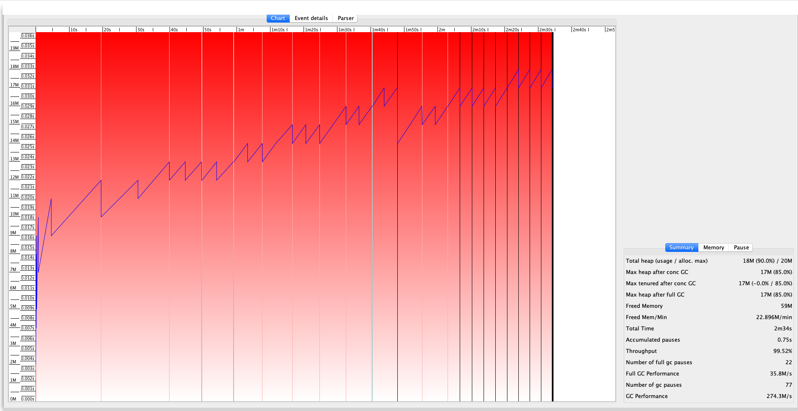
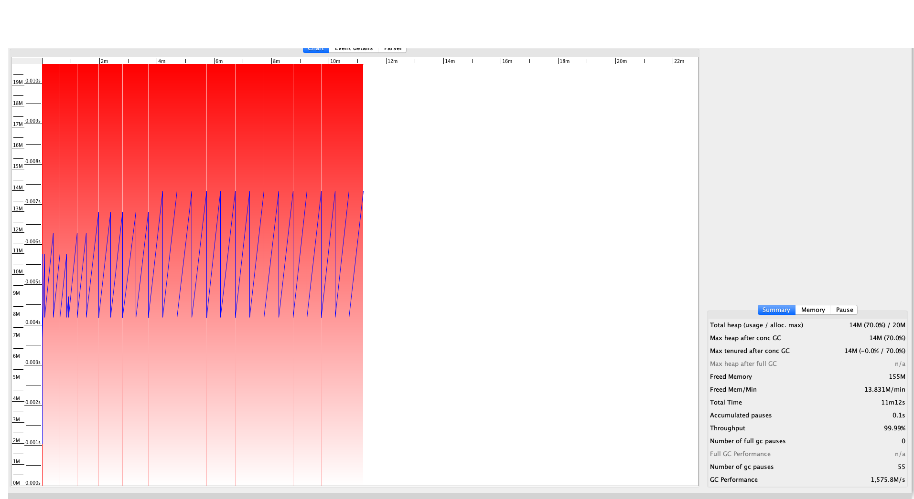

# What is this?
Java で JDBC Driver を用いて DB 接続をを行う際、`PreparedStatement` と `ResultSet` を close しないと FullGC が多発して OOME になってしまうサンプルコードです。

- こちらもご覧になってみてください: [【JUGナイトセミナー】検証では成功した Java のパッチが商用でコケた件](https://speakerdeck.com/takaichi00/jugnaitosemina-jian-zheng-dehacheng-gong-sita-java-falsepatutigashang-yong-dekoketajian)

# FullGC 再現手順
- 1万件ほどのデータを入れた DB を用意します。接続先や DB 名は以下の部分を任意に変えて設定します。
```$xslt
private static final String localConnectionUrl = "jdbc:mysql://127.0.0.1:3306/test_database";
```

- `com.takaichi00.sample.badjdbcconnection.Main` の 以下の処理をコメントアウトします。

```$xslt
stmt1.close();
rs1.close();

...

stmt3.close();
rs3.close();

...

stmt2.close();
rs2.close();

```

- コンパイルして実行可能 jar を生成します。
```$xslt
mvn clean package
```

- 以下のコマンドを実行して処理を開始します。すると GC ログが出力され、しばらくすると FullGC が発生することがわかります。
```$xslt
java -Xlog:gc:./gc.log -Xlog:gc* -Xms20M -Xmx20M -jar ./target/jdbc-bad-sample.jar
```

- 実行したディレクトリに gc.log が生成されるので、[GC Viewer](https://github.com/chewiebug/GCViewer/wiki/Changelog) でみてみると視覚的に FullGC が発生することが確認できます。

- close 処理を実施しなかった場合


- close 処理を実施した場合


