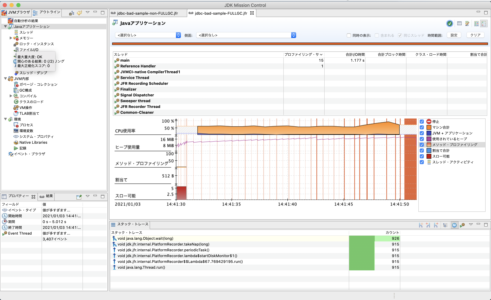
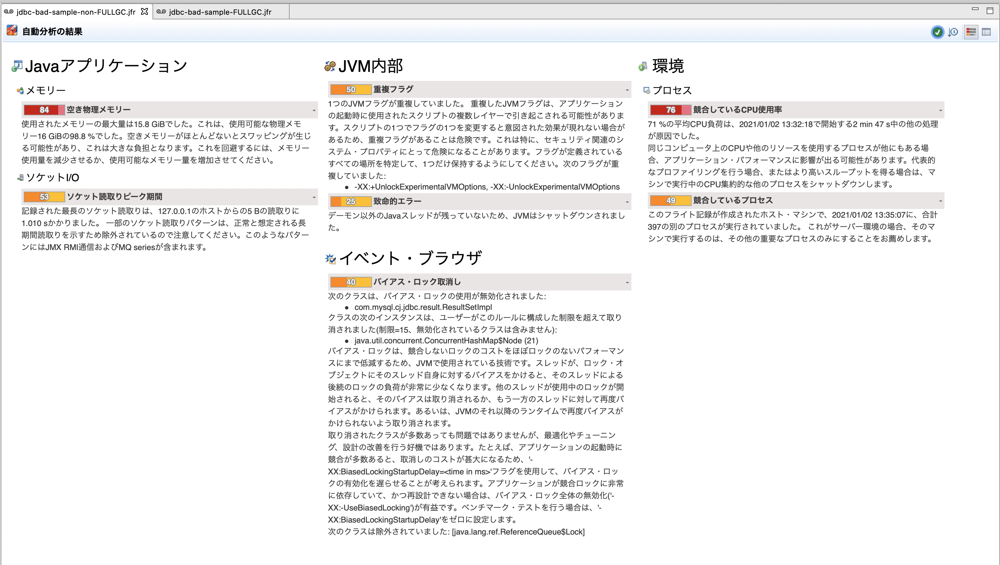

# What is this?
Java で JDBC Driver を用いて DB 接続をを行う際、`PreparedStatement` と `ResultSet` を close しないと FullGC が多発して OOME になってしまうサンプルコードです。

- こちらもご覧になってみてください: [【JUGナイトセミナー】検証では成功した Java のパッチが商用でコケた件](https://speakerdeck.com/takaichi00/jugnaitosemina-jian-zheng-dehacheng-gong-sita-java-falsepatutigashang-yong-dekoketajian)

# JFR で確認
- 1万件ほどのデータを入れた DB を用意します。接続先や DB 名は以下の部分を任意に変えて設定します。
```$xslt
private static final String localConnectionUrl = "jdbc:mysql://127.0.0.1:3306/test_database";
```

- テーブルのスキーマは flyway を実行することで作成できます
```
mvn flyway:migrate

# スキーマ管理を再作成するときは以下のコマンドを実行します
mvn flyway:clean flyway:migrate
```

- １万件のデータ生成 & insert
```
for i in {1..10000}
do
echo "$i,\"name$i\",NULL" >> insert_tableA.csv
done

for i in {1..10000}
do
echo "\"name$i\",\"address$i\"" >> insert_tableB.csv
done

# https://mita2db.hateblo.jp/entry/2020/01/13/163218
mysql -u root -h 127.0.0.1 -P 13306 -p -D test_database --local-infile=1

mysql> SET GLOBAL local_infile=on;
mysql> load data local infile "/Users/totakaic/ideaProjects/jfr-sample/jdbc-bad-sample/src/main/resources/insert_tableA.csv" into table TABLE_A fields terminated by ',' optionally enclosed by '"';
mysql> load data local infile "/Users/totakaic/ideaProjects/jfr-sample/jdbc-bad-sample/src/main/resources/insert_tableB.csv" into table TABLE_B fields terminated by ',' optionally enclosed by '"';

```

## 通常起動で JFR で解析する

- 実行可能 jar を作成します。
```
mvn clean package
```

- 以下のコマンドを実行します。
```
java -XX:StartFlightRecording=dumponexit=true,filename=./output/jdbc-bad-sample-non-FULLGC.jfr -Xms20M -Xmx20M -jar ./target/jdbc-bad-sample.jar
```

## FULL GC を発生させて JFR で解析する
- `com.takaichi00.sample.badjdbcconnection.Main` の 以下の処理をコメントアウトします。

```$xslt

stmt1.close();
rs1.close();

...

stmt3.close();
rs3.close();

...

stmt2.close();
rs2.close();

```

- 実行可能 jar を生成します。
```$xslt
mvn clean package
```

- 以下のコマンドを実行して処理を開始します。すると GC ログが出力され、しばらくすると FullGC が発生することがわかります。
```$xslt
java -XX:StartFlightRecording=dumponexit=true,filename=./output/jdbc-bad-sample-FULLGC.jfr -Xms20M -Xmx20M -jar ./target/jdbc-bad-sample.jar
```

- JMC を起動し、「ファイル(F)」→「ファイルを開く」から生成した jdbc-bad-sample-non-FULLGC.jfr, jdbc-bad-sample-FULLGC.jfr を選択すると分析結果が表示されていることを確認します。



# 通常時と FullGC 発生時の比較

## 自動分析の結果

### 通常時


#### 空き物理メモリー
- `-Xms20M -Xmx20M` を起動時に指定しているにも関わらず、「使用されたメモリーの最大量は15.8 GiBでした。」とある。
- 実行した環境は 16 GB のマシンなので、ほぼほぼマシン上限のメモリを使用していることがわかる。
- JVM の native メモリが肥大化している可能性がある?
    - メモリータブを見てみると、heap 領域は正しく設定されてそう
        - 
    - 「使用サイズ」と「合計サイズ」はたしかに 16GB 使用している
        - 
- [Using Native Memory by JVM](https://dev.classmethod.jp/articles/using-native-memory-by-jvm/)
- `-XX:MaxMetaspaceSize` を指定して実行してみるも変わらず
```
java -XX:StartFlightRecording=dumponexit=true,filename=./output/jdbc-bad-sample-non-FULLGC-limit-metaspace.jfr -Xms20M -Xmx20M -XX:MaxMetaspaceSize=1G -jar ./target/jdbc-bad-sample.jar
```
- 実行マシン自体のメモリ使用率を見ているのかもしれない
    - Docker for Mac の割当メモリを 10GB にしてたので、4GB に設定して再度実行してみる
```
java -XX:StartFlightRecording=dumponexit=true,filename=./output/jdbc-bad-sample-vacant-memory.jfr -Xms20M -Xmx20M -jar ./target/jdbc-bad-sample.jar
```
- しかし状況は変わらず...

- top コマンドでも確認してみるが、メモリ使用率が15GB以上ということはない
```
PID    COMMAND      %CPU TIME     #TH  #WQ  #POR MEM   PURG CMPR PGRP  PPID STATE    BOOSTS    %CPU_ME %CPU_OTHRS UID       FAULTS COW  MSGS
58253  java         2.0  00:08.73 23   1    113  320M  0B   0B   58253 1593 sleeping *0[1]     0.00000 0.00000    983181095 92742+ 1917 4550
```

- ネイティブ・メモリー・トラッキング(NMT) を利用してネイティブメモリをトラッキングしてみる
    - https://docs.oracle.com/javase/jp/8/docs/technotes/guides/troubleshoot/tooldescr007.html
```
java -XX:NativeMemoryTracking=summary -Xms20M -Xmx20M -jar ./target/jdbc-bad-sample.jar
jps
jcmd 58080 VM.native_memory summary
```
- 以下のような結果に。Total reserved=1419387KB≒1,386MB, committed=133959KB≒130MB と、15GB 使われるようなことはない...
```
Native Memory Tracking:

Total: reserved=1419387KB, committed=133959KB
-                 Java Heap (reserved=20480KB, committed=20480KB)
                            (mmap: reserved=20480KB, committed=20480KB)

-                     Class (reserved=1063301KB, committed=14853KB)
                            (classes #3229)
                            (  instance classes #2954, array classes #275)
                            (malloc=389KB #6608)
                            (mmap: reserved=1062912KB, committed=14464KB)
                            (  Metadata:   )
                            (    reserved=14336KB, committed=12800KB)
                            (    used=12348KB)
                            (    free=452KB)
                            (    waste=0KB =0.00%)
                            (  Class space:)
                            (    reserved=1048576KB, committed=1664KB)
                            (    used=1412KB)
                            (    free=252KB)
                            (    waste=0KB =0.00%)

-                    Thread (reserved=22618KB, committed=22618KB)
                            (thread #20)
                            (stack: reserved=22528KB, committed=22528KB)
                            (malloc=67KB #122)
                            (arena=23KB #38)

-                      Code (reserved=248177KB, committed=11197KB)
                            (malloc=489KB #2755)
                            (mmap: reserved=247688KB, committed=10708KB)

-                        GC (reserved=42125KB, committed=42125KB)
                            (malloc=8593KB #2088)
                            (mmap: reserved=33532KB, committed=33532KB)

-                  Compiler (reserved=136KB, committed=136KB)
                            (malloc=38KB #130)
                            (arena=98KB #4)

-                     JVMCI (reserved=30KB, committed=30KB)
                            (malloc=30KB #122)

-                  Internal (reserved=622KB, committed=622KB)
                            (malloc=590KB #1128)
                            (mmap: reserved=32KB, committed=32KB)

-                     Other (reserved=10KB, committed=10KB)
                            (malloc=10KB #2)

-                    Symbol (reserved=3930KB, committed=3930KB)
                            (malloc=3059KB #27392)
                            (arena=871KB #1)

-    Native Memory Tracking (reserved=675KB, committed=675KB)
                            (malloc=6KB #83)
                            (tracking overhead=668KB)

-        Shared class space (reserved=16980KB, committed=16980KB)
                            (mmap: reserved=16980KB, committed=16980KB)

-               Arena Chunk (reserved=164KB, committed=164KB)
                            (malloc=164KB)

-                   Logging (reserved=4KB, committed=4KB)
                            (malloc=4KB #180)

-                 Arguments (reserved=18KB, committed=18KB)
                            (malloc=18KB #475)

-                    Module (reserved=73KB, committed=73KB)
                            (malloc=73KB #1305)

-              Synchronizer (reserved=36KB, committed=36KB)
                            (malloc=36KB #298)

-                 Safepoint (reserved=8KB, committed=8KB)
                            (mmap: reserved=8KB, committed=8KB)
```

→ 一旦おいておく

### ソケットI/O
```
記録された最長のソケット読取りは、127.0.0.1のホストからの5 Bの読取りに1.010 sかかりました。 一部のソケット読取りパターンは、正常と想定される長期間読取りを示すため除外されているので注意してください。このようなパターンにはJMX RMI通信およびMQ seriesが含まれます。
```
→ どうやら 5B 程度の読み取りに 1s もかかっている場合があるようだ

### 重複フラグ
```
1つのJVMフラグが重複していました。 重複したJVMフラグは、アプリケーションの起動時に使用されたスクリプトの複数レイヤーで引き起こされる可能性があります。スクリプトの1つでフラグの1つを変更すると意図された効果が現れない場合があるため、重複フラグがあることは危険です。これは特に、セキュリティ関連のシステム・プロパティにとって危険になることがあります。フラグが定義されているすべての場所を特定して、1つだけ保持するようにしてください。次のフラグが重複していました:
-XX:+UnlockExperimentalVMOptions, -XX:-UnlockExperimentalVMOptions
```

### 致命的エラー
```
デーモン以外のJavaスレッドが残っていないため、JVMはシャットダウンされました。
```

### バイアス・ロック取消し
```
次のクラスは、バイアス・ロックの使用が無効化されました:
com.mysql.cj.jdbc.result.ResultSetImpl
クラスの次のインスタンスは、ユーザーがこのルールに構成した制限を超えて取り消されました(制限=15、無効化されているクラスは含みません):
java.util.concurrent.ConcurrentHashMap$Node (21)
バイアス・ロックは、競合しないロックのコストをほぼロックのないパフォーマンスにまで低減するため、JVMで使用されている技術です。スレッドが、ロック・オブジェクトにそのスレッド自身に対するバイアスをかけると、そのスレッドによる後続のロックの負荷が非常に少なくなります。他のスレッドが使用中のロックが開始されると、そのバイアスは取り消されるか、もう一方のスレッドに対して再度バイアスがかけられます。あるいは、JVMのそれ以降のランタイムで再度バイアスがかけられないよう取り消されます。
取り消されたクラスが多数あっても問題ではありませんが、最適化やチューニング、設計の改善を行う好機ではあります。たとえば、アプリケーションの起動時に競合が多数あると、取消しのコストが甚大になるため、'-XX:BiasedLockingStartupDelay=<time in ms>'フラグを使用して、バイアス・ロックの有効化を遅らせることが考えられます。アプリケーションが競合ロックに非常に依存していて、かつ再設計できない場合は、バイアス・ロック全体の無効化('-XX:-UseBiasedLocking')が有益です。ベンチマーク・テストを行う場合は、'-XX:BiasedLockingStartupDelay'をゼロに設定します。
次のクラスは除外されていました: [java.lang.ref.ReferenceQueue$Lock]
```

- バイアスロック
 - [Biased Lockingのパフォーマンス効果](https://kensir0u.hatenadiary.org/entry/20090517/1242516596)
